# Finance App

## Mô tả
Ứng dụng Flutter quản lý tài chính cá nhân, giúp người dùng:
- Theo dõi chi tiêu.
- Lên kế hoạch tài chính.
- Đạt được mục tiêu tiết kiệm.

**Tác giả:**
2121051127 - Hà Trung Hiếu - HUMG

---

## Cài đặt

### 1. Cài đặt thư viện cho Backend
```bash
cd back_end
flutter pub get
```
### 2. Cài đặt thư viện cho Frontend
```bash
cd front_end
flutter pub get
```
## Chức năng
### 1. Server

#### General Routes
- GET / <br>
Trả về thông tin cơ bản của API<br>
#### User Routes
- POST /api/v1/users/signup<br>
Đăng ký người dùng mới.<br>
- POST /api/v1/users/signin<br>
Đăng nhập người dùng.<br>
- GET /api/v1/users/userId<br>
Lấy thông tin người dùng theo ID.<br>
- GET /api/v1/users/username/username<br>
Lấy thông tin người dùng theo tên đăng nhập.<br>
- PUT /api/v1/users/userId<br>
Cập nhật thông tin người dùng.<br>
- DELETE /api/v1/users/userId<br>
Xóa người dùng.<br>
#### Transaction Routes
- GET /api/v1/transactions/userId<br>
Lấy tất cả giao dịch của người dùng.<br>
- GET /api/v1/transaction/transactionId<br>
Lấy thông tin giao dịch cụ thể theo ID.<br>
- POST /api/v1/transaction<br>
Tạo mới giao dịch.<br>
- PUT /api/v1/transaction/transactionId<br>
Cập nhật giao dịch.<br>
- DELETE /api/v1/transaction/transactionId<br>
Xóa giao dịch.<br>
- GET /api/v1/transactions/userId/aggregate/key<br>
Tổng hợp giao dịch theo một tiêu chí (vd: loại giao dịch).<br>
- GET /api/v1/transactions/userId/aggregate/key/month/year<br>
Tổng hợp giao dịch theo tháng<br>ăm.<br>

#### Spending Plan Routes
- GET /api/v1/spending-plans/userId<br>
Lấy tất cả kế hoạch chi tiêu của người dùng.<br>
- POST /api/v1/spending-plans/userId<br>
Tạo hoặc cập nhật kế hoạch chi tiêu.<br>
- DELETE /api/v1/spending-plans/userId/spentPlan<br>
Xóa kế hoạch chi tiêu.<br>
#### Dashboard Routes
- GET /api/v1/dashBoard/userId<br>etworth/current<br>
Lấy giá trị tài sản ròng hiện tại.<br>
- GET /api/v1/dashBoard/userId<br>etworth/detail<br>
Lấy chi tiết tài sản ròng.<br>
- GET /api/v1/dashBoard/userId/category/current/numberOfCategory<br>
Lấy danh mục chi tiêu hiện tại.<br>
- GET /api/v1/dashBoard/userId/category/detail<br>
Lấy chi tiết danh mục chi tiêu.<br>
- GET /api/v1/dashBoard/userId/spending-plant/current<br>
Lấy thông tin kế hoạch chi tiêu hiện tại.<br>
- GET /api/v1/dashBoard/userId/spending-plant/detail/spentPlan<br>
Lấy chi tiết kế hoạch chi tiêu.<br>
#### Spending Plan Details
- GET /api/v1/spending-plans/userId/spentPlan/type<br>
Lấy chi tiết kế hoạch chi tiêu theo loại.<br>
### 2. Client
#### User
- ##### sign in
<br>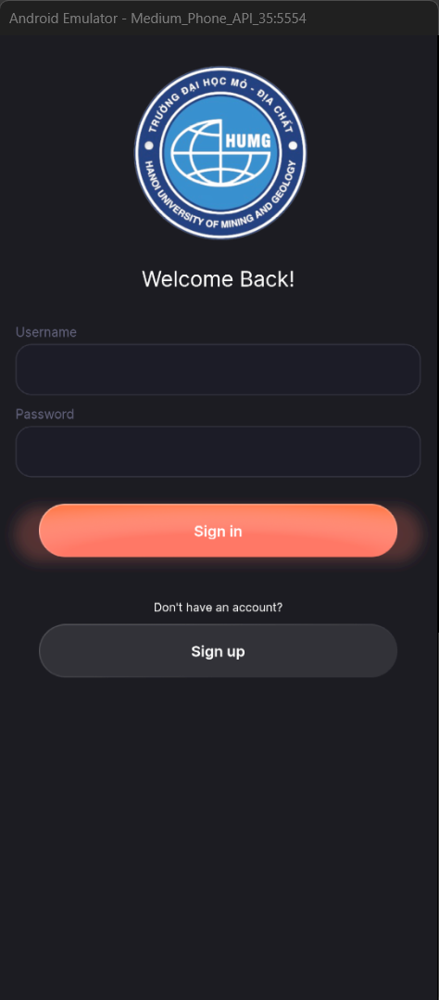<br>
- ##### sign up
<br>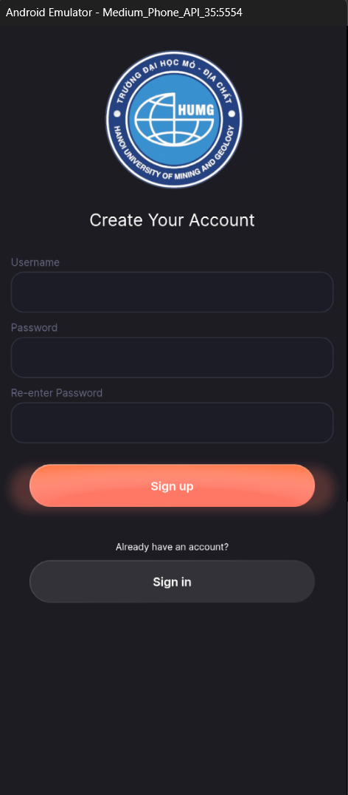<br>
#### Dash board Tab
<br>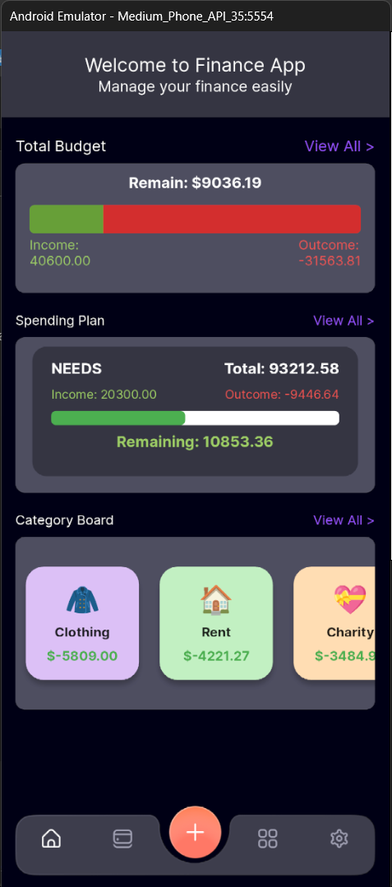<br>
- ##### Total Budget
dùng để theo dõi tổng kết tỉ lệ outcome / income trong tháng
 <br>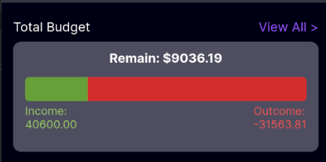<br>
- ##### Spending Plan
dùng để theo dõi tổng kết số dư của plan và tỉ lệ outcome / income trong tháng
<br>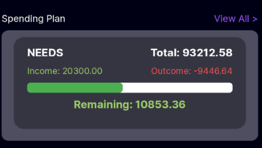<br>
- ##### Category Board
hiện thị top category chi tiêu
<br>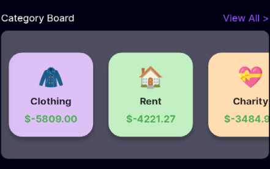<br>
#### Spending Plan Tab
<br>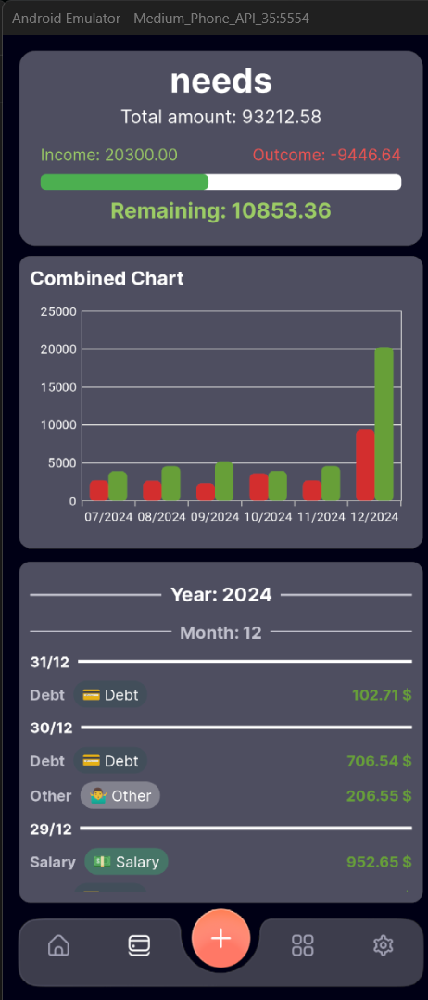<br>
- ##### Spending Plan Card
các card có thể trượt sang để xem các plan chi tiêu khác
theo dõi tổng số dư và tỉ lệ outcome / income trong tháng
<br>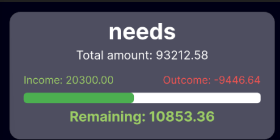<br>
<br>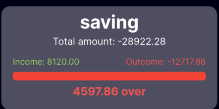<br>
<br>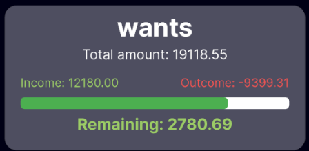<br>
khi ấn hiện thị tỉ lệ giữa các plan
<br>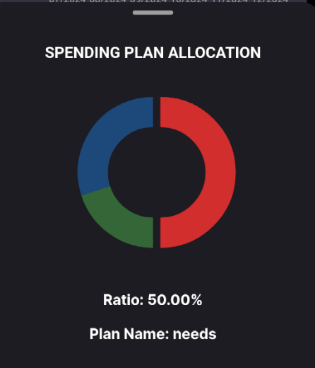<br>
- ##### Spending Plan Chart
các biểu đồ có thể trượt sang để xem các option filter chi tiêu khác
theo dõi tỉ lệ tăng giảm giữa các tháng
<br>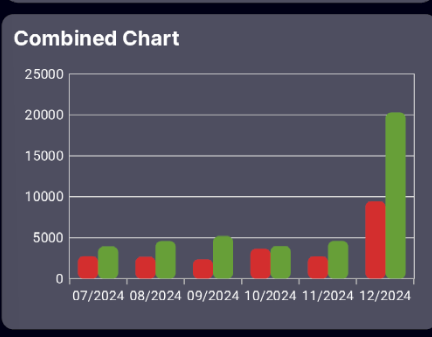<br>
<br>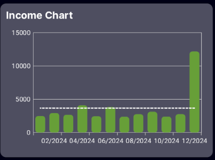<br>
<br>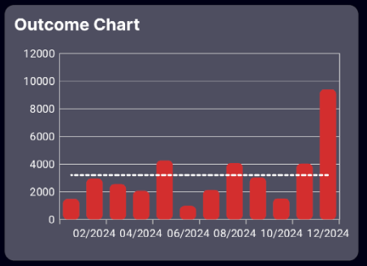<br>
*Chức năng cho phép người dùng có thể lọc biểu đồ theo tháng đang được phát triển.*
- ##### Spending Plan Detail
<br>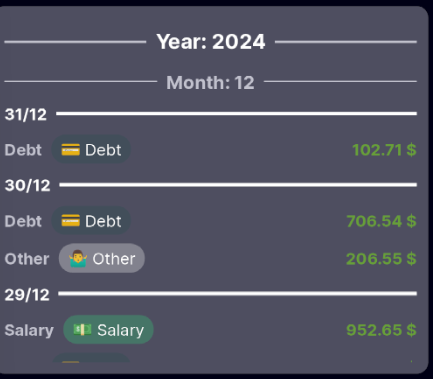<br>
*Chức năng cho phép người dùng có thể lọc các giao dịch theo khoảng thời gian đang được phát triển*
#### Category Tab
<br>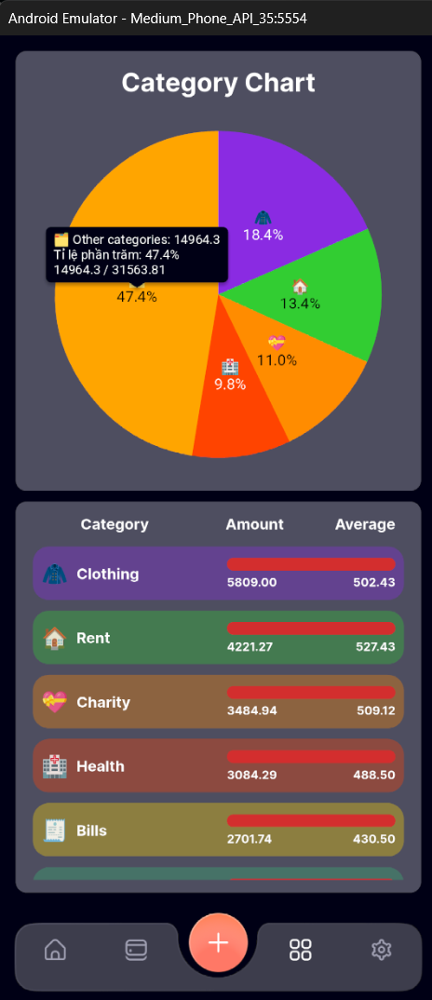<br>
- ##### Category Chart
hiện thị biểu đồ top 4 các category được chi tiêu nhiều nhất trong tháng
<br>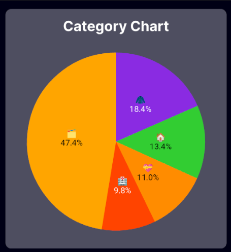<br>
*Chức năng cho phép người dùng có thể lọc biểu đồ theo top category thay vì 4 category cố định đang được phát triển.*
- ##### Category Detail
hiện thị các category được chi tiêu từ cao đến thấp trong tháng
<br>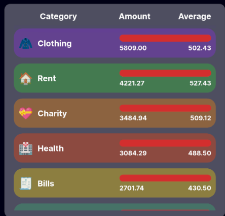<br>
*Chức năng cho phép người dùng có thể các giao dịch theo category được nhấn vào đang được phát triển.*
#### User Tab
<br>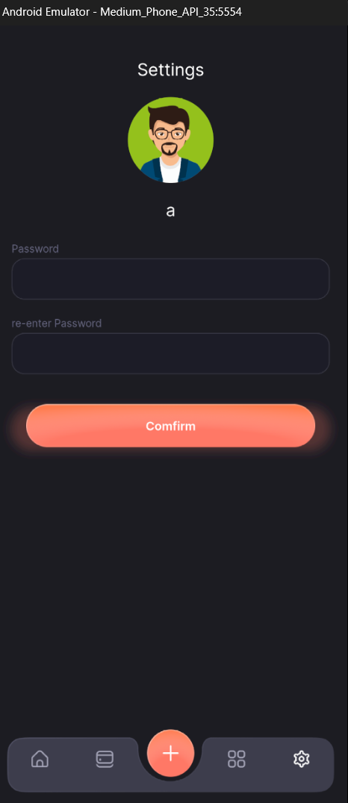<br>
chức năng chính để người dùng đổi mật khẩu

#### Chức năng thêm giao dịch
<br>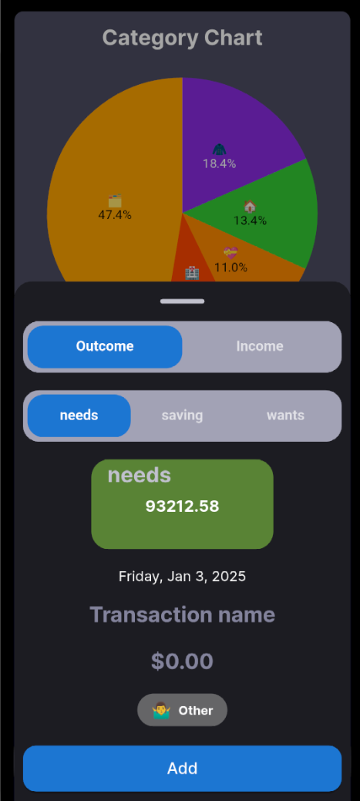<br>
*Chức năng cho phép người dùng có thể chuyển nguồn tiền từ các plan đang được phát triển.*

#### Chức năng sửa hoặc xóa giao dịch
<br>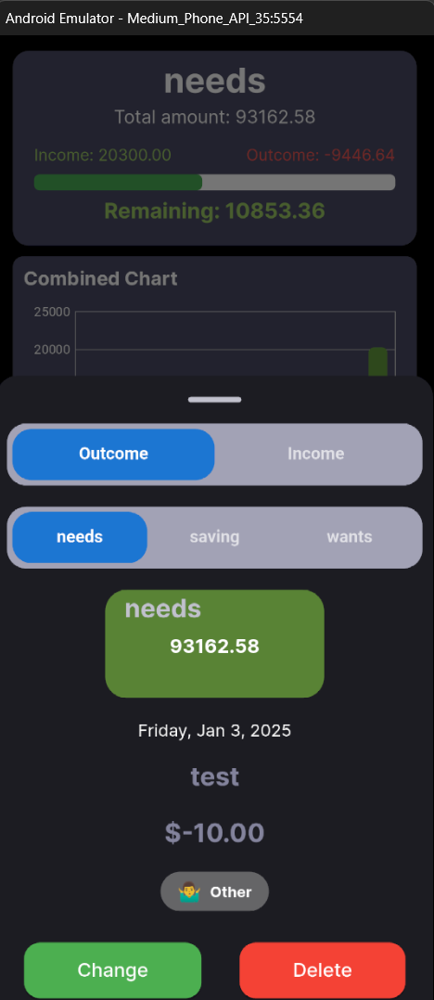<br>

## Liên hệ
- Email: your.email@example.com
- GitHub: username

